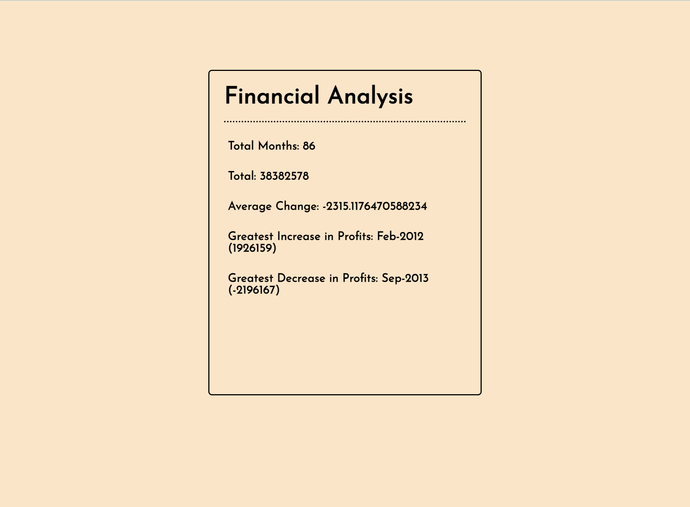
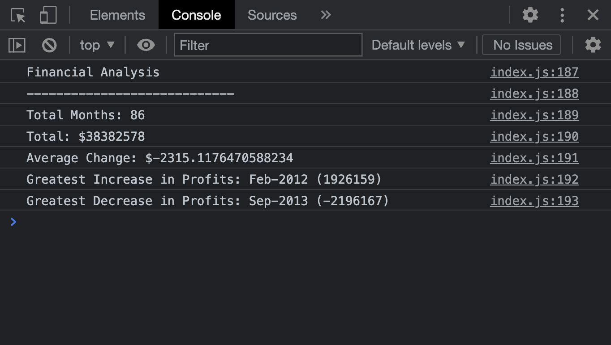

# Console-Finances

## Table of contents

- [Description](#description)
- [Screenshot](#screenshot)
- [Links](#links)
- [Built with](#built-with)
- [Author](#author)

## Description

Financial Analysis tool to calculate a set of Months, Profit/Losses, Average change of Profit/Losses and Greatest Increase and Decrease of a Financial Dataset composed of "Date" and "Amount of Profit/Losses"

## Screenshot

## Links

[Github](https://github.com/Kevin27j/Console-Finances)
[Live Site](https://kevin27j.github.io/Console-Finances/)

## Built with

- HTML
- CSS
- Javascript

## Author

[Kejvin Pashaj](https://github.com/Kevin27j)
